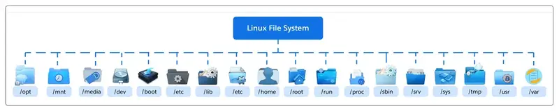

## Pendahuluan
Saat pertama kali menggunakan Linux, banyak pengguna merasa bingung melihat banyaknya folder seperti `/bin`, `/etc`, `/usr`, atau `/var`. Berbeda dengan sistem operasi lain yang lebih sederhana, Linux memiliki struktur direktori yang sangat terorganisir dan memiliki aturan standar.

Bayangkan jika semua barang di rumah diletakkan secara acak tanpa tempat khusus. Kita pasti akan kesulitan mencari pakaian, buku, atau alat tertentu. Linux juga bekerja dengan prinsip yang sama. Setiap file dan program ditempatkan pada lokasi yang memiliki fungsi tertentu agar sistem tetap rapi, mudah dikelola, dan konsisten.

Untuk menjaga keteraturan tersebut, Linux menggunakan standar bernama *Filesystem Hierarchy Standard (FHS)*.

## Apa Itu Filesystem Hierarchy Standard (FHS)?
**Filesystem Hierarchy Standard (FHS)** adalah standar yang mengatur struktur direktori utama pada sistem operasi Linux dan UNIX.

Standar ini awalnya dikelola oleh Free Standards Group, dan sekarang berada di bawah pengelolaan The Linux Foundation.

Tujuan utama FHS adalah:

- Membuat lokasi file mudah diprediksi
- Memudahkan administrator sistem mengelola server
- Membantu aplikasi mengetahui tempat penyimpanan file yang benar
- Menjaga konsistensi antar distribusi Linux

Sebagian besar distribusi Linux seperti Ubuntu, Debian, Fedora, Arch Linux, dan CentOS mengikuti standar ini, meskipun kadang terdapat sedikit perbedaan implementasi.

## Struktur Direktori Utama Linux
Berikut adalah direktori-direktori penting yang umum ditemukan pada sistem Linux.

| Direktori | Fungsi |
|---|---|
| `/` | Root, direktori utama dari seluruh filesystem |
| `/bin` | Binary penting untuk command dasar seperti `ls`, `cp`, `mv`, `rm` |
| `/boot` | File yang dibutuhkan untuk proses booting seperti kernel dan GRUB |
| `/dev` | File khusus untuk hardware/device |
| `/etc` | File konfigurasi sistem |
| `/home` | Home directory untuk user biasa |
| `/lib` | Library penting yang dibutuhkan program di `/bin` dan `/sbin` |
| `/lib64` | Library 64-bit untuk sistem yang mendukung aplikasi 64-bit |
| `/media` | Mount point untuk media removable seperti USB atau CD/DVD |
| `/mnt` | Mount point sementara untuk filesystem eksternal |
| `/opt` | Lokasi software pihak ketiga yang terisolasi |
| `/proc` | Filesystem virtual berisi informasi kernel dan process |
| `/run` | Data runtime sejak sistem boot |
| `/sys` | Pseudo-filesystem untuk device, driver, dan kernel module |
| `/root` | Home directory milik superuser/root |
| `/sbin` | Binary penting untuk administrasi sistem |
| `/srv` | Data yang disediakan oleh service sistem seperti web atau FTP |
| `/tmp` | Direktori file sementara |
| `/usr` | Aplikasi multi-user, utility, dan library tambahan |
| `/var` | Data yang sering berubah seperti log, cache, dan database |

## Kesimpulan

Struktur direktori Linux dibuat agar sistem tetap terorganisir, konsisten, dan mudah dikelola.

Dengan memahami struktur direktori standar Linux:

- Administrator lebih mudah melakukan maintenance
- Developer lebih mudah menentukan lokasi file aplikasi
- User lebih mudah memahami sistem Linux

Filesystem Hierarchy Standard (FHS) menjadi fondasi penting yang menjaga konsistensi antar distribusi Linux sehingga sistem tetap mudah dipahami dan digunakan.
